# ✦ Celestial Desk

**A beautiful, self-hosted productivity suite** — deadlines, weekly planner, journal, boards, life goals, finance, and sports, all behind a dreamy "Starry Night" interface.

> *"What makes the desert beautiful,' said the little prince, 'is that somewhere it hides a well."*
> — Antoine de Saint-Exupéry, *The Little Prince*


---

## ✨ Features

| Module | What it does |
|--------|--------------|
| **Dashboard** | Overview of overdue/due-soon deadlines, completed today, real **weekly progress**, daily habits, hours breakdown chart, tag performance and this week's plan |
| **Deadlines** | Create, track and complete deadlines with priority, tags and subtasks |
| **Smart Notifications** | Browser/OS alerts at **3d, 2d, 1d and 1h** before a deadline, plus overdue alerts and **startup catch-up** for anything you missed while offline — available on any OS (Windows, macOS, Linux) |
| **Weekly Planner** | Day-by-day grid with time blocks, tags, completion tracking, mood and notes |
| **Daily Journal** | Record *what you did*, *plans* and *reflections*, with mood tracking and Markdown |
| **Boards** | Trello-like drag-and-drop boards **+ tables + freeform whiteboards** |
| **Life Tree** | Visualize long-term and short-term goals as a tree (with a 3D view) |
| **Connections** | A people/relationships graph with search, tags and a force-directed visualization |
| **Reports** | Daily / weekly / monthly reports and an auto-generated **daily summary** |
| **Sports** | Log workouts and track duration |
| **Finance** | Cards, income/expense transactions and categorization |
| **Daily Habits** | Fillable habit boxes (up to 6) with edit/delete |
| **Global Search** | Instant search across everything (`Ctrl+K`) |
| **Backup / Restore** | One-click JSON export/import in Settings, or CLI backups via `make backup` |
| **Themes** | "Cosmic" (navy & teal) and "🎀 Kitty" (Hello Kitty pink) |

---

## 📸 Screenshots

| | |
|---|---|
| 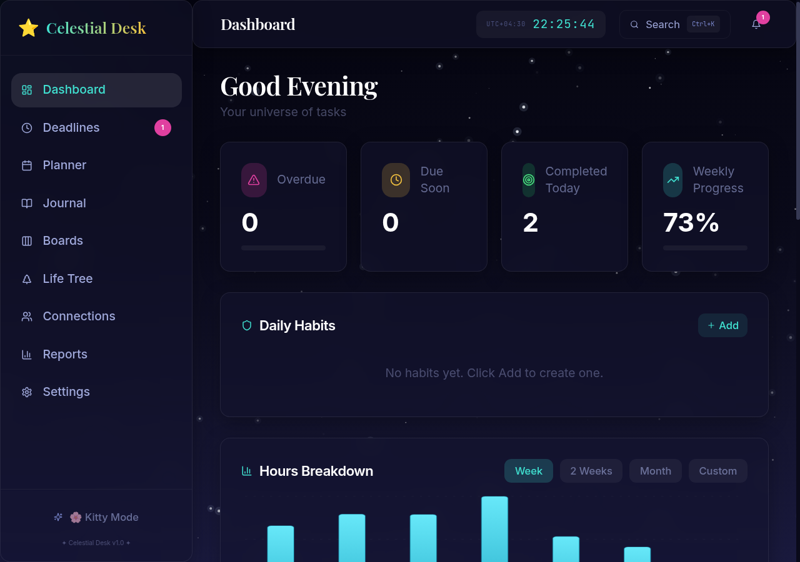 | 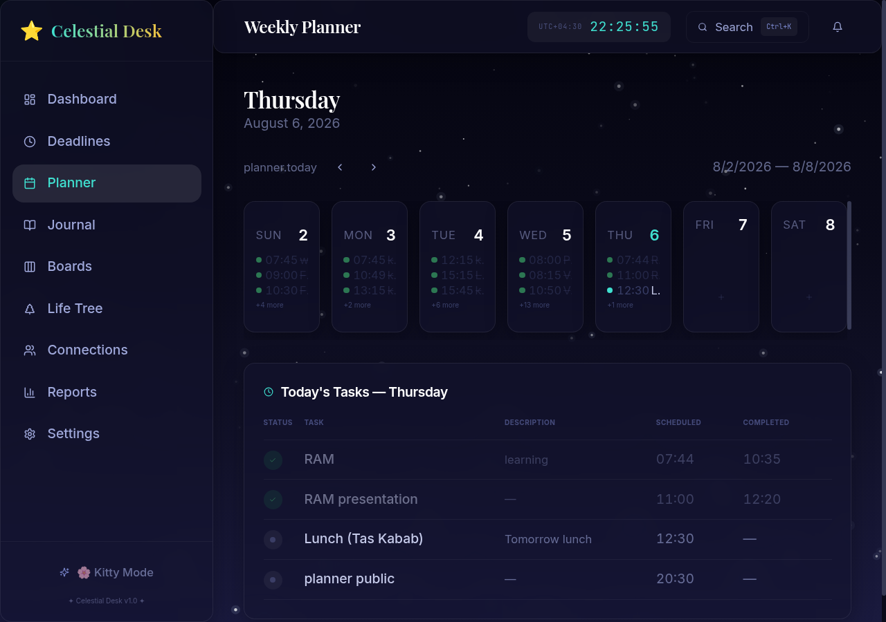 |
| 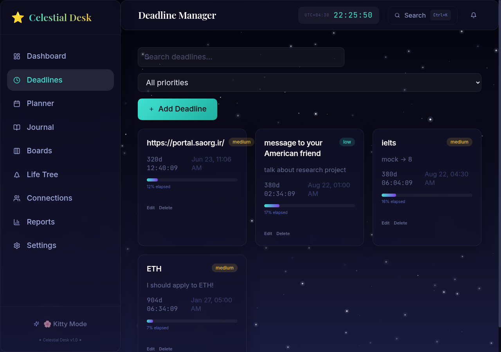 | 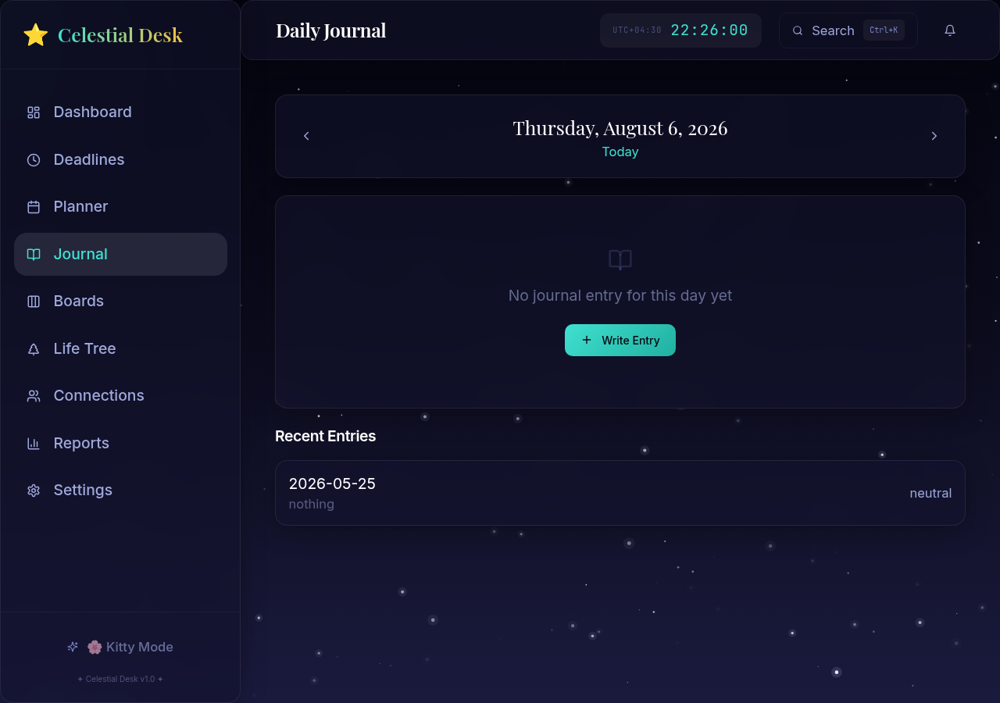 |
| 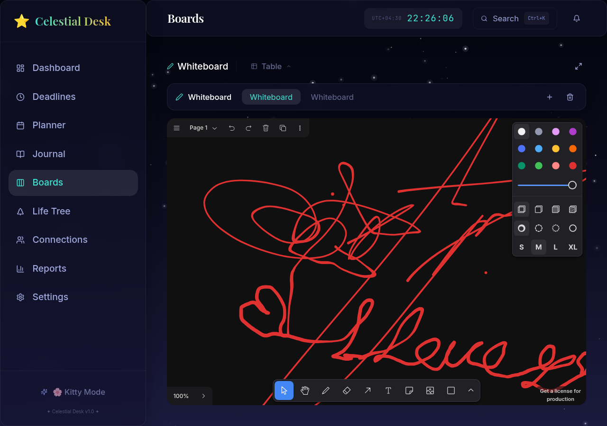 | 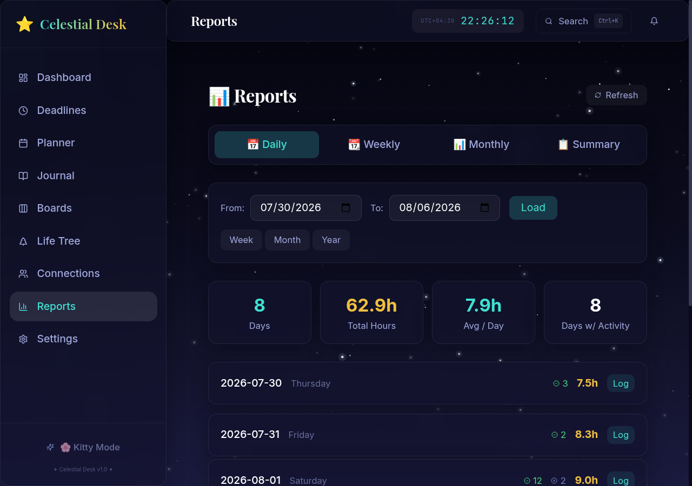 |
| 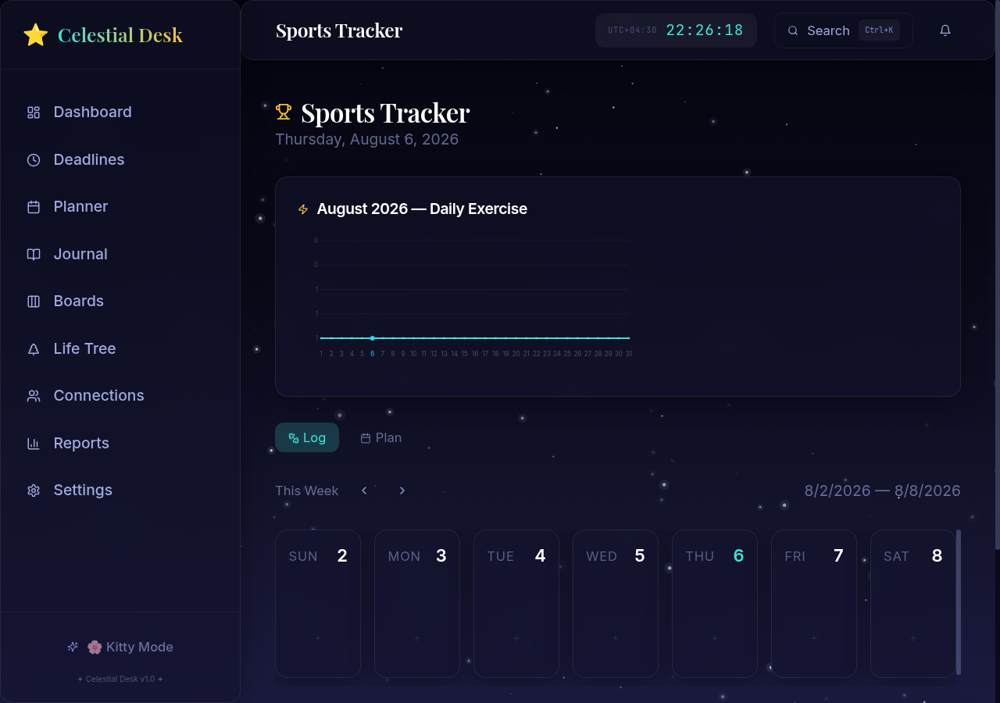 | 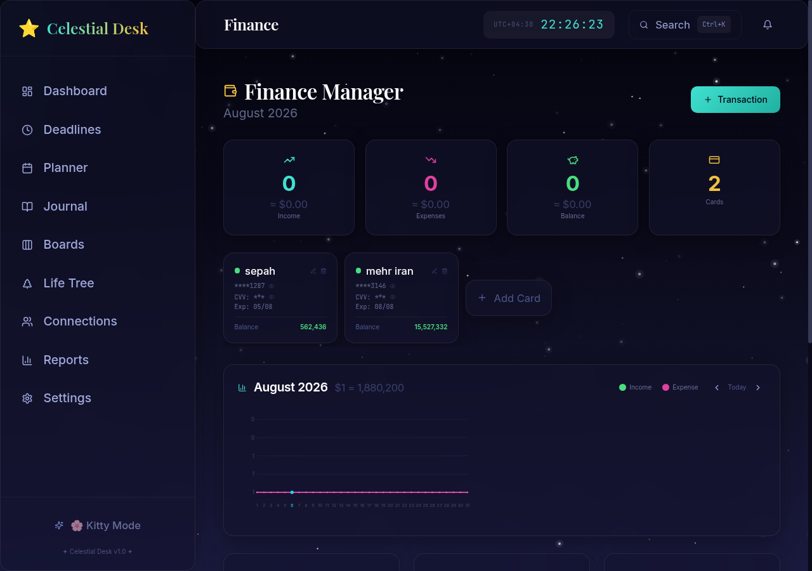 |
| 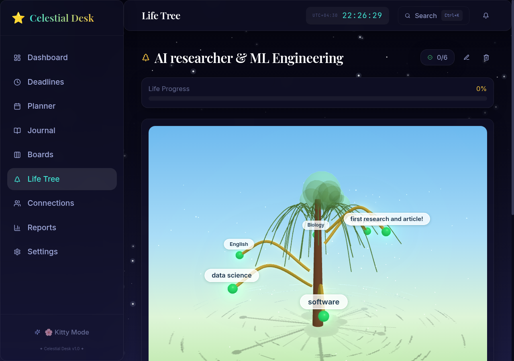 | 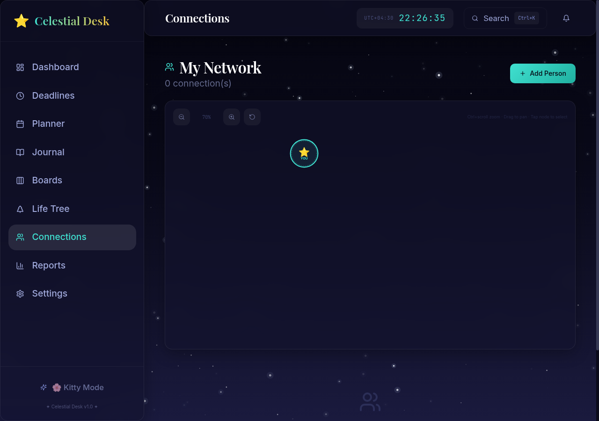 |
| 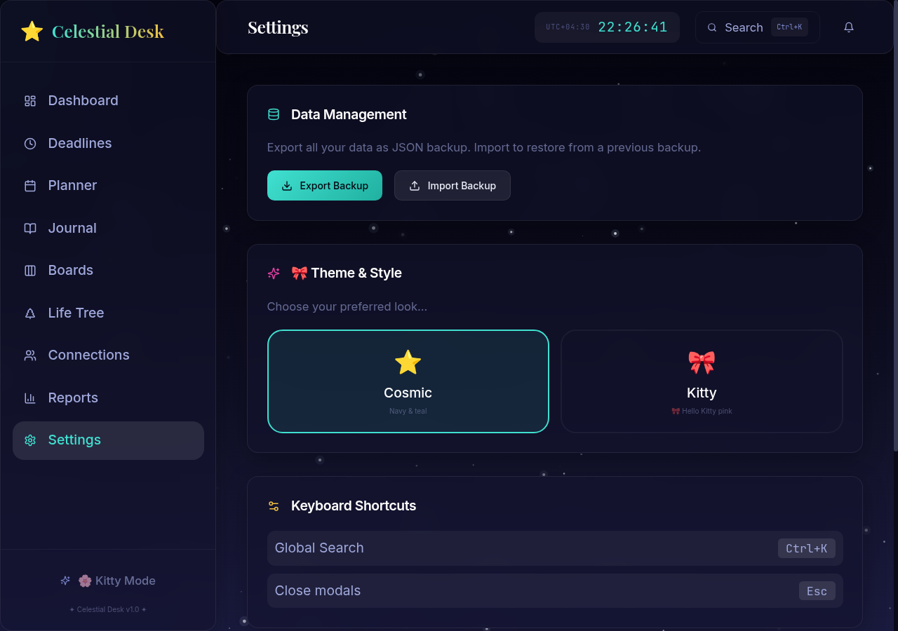 | |

---

## 🧩 Tech Stack

| Layer     | Technology |
|-----------|------------|
| Frontend  | React 18 · TypeScript · Vite · TailwindCSS · Framer Motion · Zustand · Three.js |
| Backend   | Python 3.12 · FastAPI · APScheduler · plyer |
| Storage   | JSON files with atomic writes (no database required) |
| Deployment| Docker · Docker Compose · Nginx |

---

## 🏗 Architecture

```
┌───────────────────────────────────────────────────────────┐
│                  Frontend (React + Vite)                   │
│   Dev : Vite dev server → http://localhost:3030            │
│   Prod: Nginx (static build) → http://localhost:3030       │
└──────────────┬────────────────────────────────────────────┘
               │  /api/*  (reverse-proxied by Vite / Nginx)
┌──────────────▼────────────────────────────────────────────┐
│                  Backend (FastAPI)                         │
│   http://localhost:8000  ·  docs at /docs                  │
│   Routes: deadlines, planner, journal, boards, tables,     │
│   whiteboards, sports, habits, finance, life-tree,         │
│   connections, reports, daily-summary, search, backup   │
└──────────────┬────────────────────────────────────────────┘
               │
┌──────────────▼────────────────────────────────────────────┐
│               Data (JSON files, host ./data/)              │
│   deadlines.json · planner.json · journal.json · ...       │
│   Daily summaries · chat history · notification history    │
└────────────────────────────────────────────────────────────┘
```

### Project structure

```
celestial-desk/
├── backend/
│   ├── Dockerfile
│   ├── requirements.txt
│   └── app/
│       ├── main.py                 # FastAPI entry point
│       ├── config.py               # Environment configuration
│       ├── models/                 # Pydantic models (one per module)
│       ├── routes/                 # API routers (one per module)
│       ├── services/               # Storage engine, notifications
│       └── scheduler/              # APScheduler deadline engine
├── frontend/
│   ├── Dockerfile
│   ├── nginx.conf                  # Production reverse proxy
│   ├── vite.config.ts
│   └── src/
│       ├── api/client.ts           # Typed API client
│       ├── store/useStore.ts       # Zustand state
│       ├── components/             # Layout, Sidebar, StarBackground, ...
│       ├── pages/                  # One page per module
│       ├── i18n/                   # Translation keys
│       └── types/                  # TypeScript interfaces
├── scripts/
│   ├── install-docker.sh           # OS-aware Docker install
│   ├── doctor.sh                   # Environment check
│   ├── setup.sh                    # .env + data dir
│   ├── backup.sh / restore.sh      # Data backups
│   ├── start.sh / stop.sh / logs.sh
│   └── enable-boot.sh              # Auto-start on boot (systemd)
├── docker-compose.yml
├── .env.example
└── Makefile                        # One-command everything
```

---

## 🚀 Quick Start

> The whole project runs through `make`. You only need **Docker** and **Git**.

```bash
git clone <your-repo-url> celestial-desk
cd celestial-desk

make install   # only if Docker is not installed yet (auto-detects your OS)
make doctor    # optional: verify Docker, Compose, ports, .env
make setup     # creates .env + data/  (first time only)
make up        # builds and starts the app
```

Open **http://localhost:3030** — done.

### All Makefile commands

| Command                 | What it does                                          |
|-------------------------|-------------------------------------------------------|
| `make help`             | List every available command                          |
| `make install`          | Install Docker + Compose for your OS (Linux/macOS)    |
| `make doctor`           | Check prerequisites (Docker, Compose, ports, `.env`)  |
| `make setup`            | One-time setup: create `.env` + `data/`               |
| `make up`               | Build & start (development mode, hot reload)          |
| `make prod`             | Build & start (production/optimized build)            |
| `make dev`              | Start only the frontend dev server                    |
| `make stop` / `make down` | Stop all services (data is kept)                    |
| `make restart`          | Restart all services                                  |
| `make ps`               | Show running services                                 |
| `make build`            | Build the Docker images                               |
| `make rebuild`          | Rebuild images and restart the stack                  |
| `make logs`             | Follow logs of all services                           |
| `make logs-backend`     | Follow backend logs                                   |
| `make logs-frontend`    | Follow frontend (dev) logs                            |
| `make backup`           | Timestamped backup of `./data` → `data/backups/`      |
| `make restore FILE=...` | Restore a backup into `./data`                        |
| `make enable-boot`      | Auto-start on boot (Linux / systemd)                  |
| `make clean`            | Remove containers & anonymous volumes (keeps `./data`)|

---

## 🖥 Platform Guides

### 1. Debian / Ubuntu (and Mint, Pop!_OS, ...)

```bash
# 1. Install prerequisites
sudo apt update
sudo apt install -y git make curl ca-certificates

# 2. Install Docker + Compose (also installs libnotify-bin for desktop alerts)
make install        # runs scripts/install-docker.sh

# 3. Log out and back in (or run: newgrp docker) so Docker works without sudo

# 4. Clone, setup and start
git clone <your-repo-url> celestial-desk && cd celestial-desk
make setup
make up
```

**Manual alternative** (if you don't want to use `make`):

```bash
sudo apt install -y docker.io docker-compose-v2 libnotify-bin
sudo usermod -aG docker $USER        # then re-login
newgrp docker

./scripts/setup.sh
./scripts/start.sh
```

### 2. Other Linux (Fedora / RHEL / Arch)

```bash
# Fedora / RHEL / Rocky
sudo dnf install -y git make docker docker-compose-plugin libnotify
sudo systemctl enable --now docker
sudo usermod -aG docker $USER

# Arch / Manjaro
sudo pacman -Sy git make docker docker-compose libnotify
sudo systemctl enable --now docker
sudo usermod -aG docker $USER
```

Then (re-login first):

```bash
git clone <your-repo-url> celestial-desk && cd celestial-desk
make setup
make up
```

> 💡 If you already have Docker installed on any Linux distro, just run `make doctor` to verify, then `make up`.

### 3. macOS

```bash
# 1. Install command-line tools (provides make, git, etc.)
xcode-select --install

# 2. Install Homebrew (if needed): https://brew.sh

# 3. Install Docker Desktop
make install        # runs: brew install --cask docker

# 4. Open "Docker Desktop" once from Applications and let it finish starting

# 5. Clone, setup and start
git clone <your-repo-url> celestial-desk && cd celestial-desk
make setup
make up
```

> Apple Silicon (M1/M2/M3) and Intel both work — Docker Desktop runs natively.

### 4. Windows

Two supported options — **choose one**:

**Option A — WSL2 (recommended):** install [WSL](https://learn.microsoft.com/windows/wsl/install) + Ubuntu, install [Docker Desktop](https://www.docker.com/products/docker-desktop/), then inside your Ubuntu WSL terminal:

```bash
git clone <your-repo-url> celestial-desk && cd celestial-desk
make setup
make up
```

**Option B — Git Bash:** install [Docker Desktop for Windows](https://docs.docker.com/desktop/install/windows-install/), then open **Git Bash** and run:

```bash
make setup
make up
```

> ⚠️ `make` and the helper scripts are bash-based, so use **WSL2** or **Git Bash** — the plain `cmd.exe` / PowerShell prompt is not supported. Deadline notifications work on any OS via the browser's notification API (enable it in **Settings**); on Windows set `TZ` in `.env`.

---

## ⚙️ Configuration

Copy `.env.example` to `.env` (done automatically by `make setup`) and adjust:

```env
TZ=UTC                                 # Your IANA timezone (e.g. Europe/Berlin, America/New_York, Asia/Tehran)
LOG_LEVEL=INFO                         # DEBUG | INFO | WARNING | ERROR
DATA_DIR=/data                         # Path inside the container (leave as-is)
```

- `TZ` controls all date handling and the deadline notification engine. It boots to **UTC** by default so any machine works out of the box. On Linux, `scripts/start.sh` auto-detects your system timezone (`Europe/Berlin`, `Asia/Tehran`, ...) when `TZ` is left unset — on macOS/Windows set it manually in `.env`.

### Services & ports

| Service  | URL                      |
|----------|--------------------------|
| Frontend | http://localhost:3030    |
| Backend  | http://localhost:8000    |
| API Docs | http://localhost:8000/docs |

---

## 💾 Data & Backups

All data lives as JSON files in `./data/` on your host (mounted into the container at `/data`). It **survives restarts and container recreation**.

| File                     | Contents                          |
|--------------------------|-----------------------------------|
| `deadlines.json`         | Deadlines, subtasks, reminder flags |
| `planner.json`           | Weekly planner entries            |
| `journal.json`           | Journal entries                   |
| `whiteboards.json`       | Whiteboards                       |
| `sports.json`            | Workout logs                      |
| `habits.json`            | Daily habits                      |
| `finance_cards.json` / `finance_transactions.json` | Finance data |
| `life_tree.json`         | Life Tree goals                   |
| `connections.json`       | People/relationships graph        |
| `notification_history.json` | Notification log              |
| `daily_summaries.json`   | Auto-generated daily summaries    |

**Backups**

```bash
make backup                    # → data/backups/celestial-desk-<timestamp>.tar.gz
make restore FILE=data/backups/celestial-desk-<timestamp>.tar.gz
```

You can also export/import a single JSON file from **Settings → Data**.

---

## 🔌 API Overview

Interactive docs are at **http://localhost:8000/docs**. All endpoints live under `/api/` and are proxied through the frontend, so the browser can call `/api/...` directly.

| Area        | Endpoints |
|-------------|-----------|
| Deadlines   | `GET/POST /api/deadlines`, `GET/PATCH/DELETE /api/deadlines/{id}` |
| Planner     | `GET/POST /api/planner`, `GET/PATCH/DELETE /api/planner/{id}` |
| Journal     | `GET/POST /api/journal`, `GET/PATCH/DELETE /api/journal/{id}` |
| Sports      | `GET/POST /api/sports`, `GET/PATCH/DELETE /api/sports/{id}`, `GET /api/sports/date/{date}` |
| Habits      | `GET/POST /api/habits`, `PATCH/DELETE /api/habits/{id}` |
| Whiteboards | `GET/POST /api/whiteboards`, `GET/PUT/DELETE /api/whiteboards/{id}` |
| Tables      | `GET/POST /api/tables`, `GET/PUT/DELETE /api/tables/{id}` |
| Finance     | `GET/POST /api/finance/cards`, `GET/POST /api/finance/transactions`, ... |
| Life Tree   | `GET/POST /api/life-tree`, `PATCH/DELETE /api/life-tree/{id}` |
| Connections | `GET/POST /api/connections`, search, positions, ... |
| Reports     | `GET /api/report?start_date=&end_date=` |
| Summary     | `GET /api/daily-summary?date=`, `GET /api/daily-summary/range?start_date=&end_date=` |
| Search      | `GET /api/search?q=...` |
| Notifications | `GET /api/notifications`, `POST /api/notifications/{id}/read` |
| Backup      | `GET /api/backup/export`, `POST /api/backup/import` |
| Health      | `GET /api/health` |

---

## 🔔 Notification Engine

An APScheduler loop inside the backend checks deadlines every 15 minutes:

- **3 days before** · **2 days before** · **1 day before** · **1 hour before** — notification
- **Overdue** — critical notification
- **Startup catch-up** — if the machine was off during a notification window, all missed alerts fire on the next start
- Every notification is written to `notification_history.json` and shown in the app's bell

The backend stores every alert in-app (the bell in the header), and the frontend can also fire **native OS notifications** through the browser's Notification API — works the same on Windows, macOS and Linux. Enable it in **Settings → System Info → Notification Engine** (a browser permission prompt appears).

> Native desktop `notify-send`/D-Bus notifications are still tried on Linux where available, and always fall back gracefully to the in-app bell.

---

## 🛠 Development (without Docker)

**Backend**

```bash
cd backend
python3 -m venv .venv && source .venv/bin/activate
pip install -r requirements.txt
uvicorn app.main:app --reload --port 8000
```

**Frontend**

```bash
cd frontend
npm install
npm run dev          # serves on port 80 (as configured) — add --port 5173 if that port is busy
```

> The Vite dev server proxies `/api` to the backend at `:8000`, so you can use the frontend against a locally-running backend.

**Useful targets while developing**

```bash
make dev             # containerized frontend with hot reload
make logs-backend    # follow backend logs
make rebuild         # rebuild images and restart
```

---

## ❓ Troubleshooting

| Problem | Solution |
|---------|----------|
| `docker: permission denied` | Log out/in after `make install`, or run `sudo usermod -aG docker $USER && newgrp docker` |
| Port already in use | `make doctor` shows which ports are busy; edit the port mapping in `docker-compose.yml` or free the port |
| No browser notifications | Open **Settings → System Info → Notification Engine** and toggle it on (allows the site's notification permission) |
| No native desktop notification (Linux) | Make sure `libnotify-bin` is installed and you're in a graphical session (`echo $DISPLAY`). The in-app bell + browser notifications still work regardless |
| Need to start fresh | `make clean` removes containers (your `./data/` is kept) |
| Backend docs not loading | Check `make ps` — the backend must be `healthy` before the frontend starts |

---

## 📄 License

MIT — use it, fork it, enjoy it. ✦
